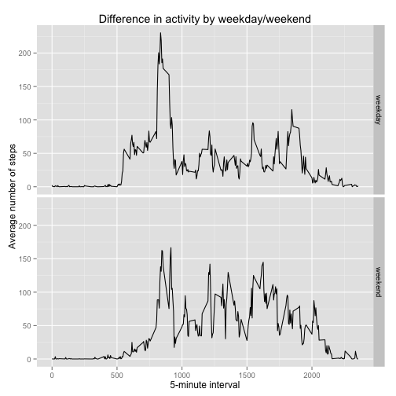

Reproducible Research Assignment 1
========================================================

## Introduction

The objective of this report is to analyse personal activity data generated by a monitoring device in order to obtain specific insights

## Loading data

As a first step, the relevant dataset must be loaded. For the purpose of this report, we will **assume that the dataset is stored in R's current working directory**.
Also, transform the data type of field *date* in a proper date format.


```r
rawData <- read.csv("activity.csv")
rawData$date <- as.Date(rawData$date, format = "%Y-%m-%d")
```


## Mean total number of steps taken per day

The histogram shows the distribution of steps taken per day. Notice that in order to obtain this chart, *steps* data had to be aggregated (sum) by date.

```r
aggData <- aggregate(rawData$steps, by = list(rawData$date), FUN = sum, na.rm = TRUE)
aggSteps <- as.numeric(unlist(aggData[2]))
hist(aggSteps, breaks = 10, col = "black", main = "Histogram of steps taken per day", 
    xlab = "steps per day")
```

 

Now we compute the mean and median:

```r
mean(aggSteps, na.rm = TRUE)
```

```
## [1] 9354
```

```r
median(aggSteps, na.rm = TRUE)
```

```
## [1] 10395
```


## Average daily activity pattern

This time-series chart shows the evolution of average steps for every 5-minute interval. 

```r
aggInt <- aggregate(rawData$steps, by = list(rawData$interval), FUN = mean, 
    na.rm = TRUE)
plot(aggInt$x, type = "l", main = "Average steps per interval", xlab = "5-minute interval", 
    ylab = "average steps", xaxt = "n")
axis(1, at = 1:length(aggInt$Group.1), labels = aggInt$Group.1)
```

 

It can be seen that the interval which contains the maximum  average number of steps (206) is 835:

```r
aggInt[which.max(aggInt$x), ]
```

```
##     Group.1     x
## 104     835 206.2
```


## Imputing missing values

The first task is to calculate the number of **NA** cases in the *steps* field within the dataset. It turns out there are **2304 missing values** 


```r
sum(is.na(rawData))
```

```
## [1] 2304
```


The next task is to substitute the NA values following a chosen filling strategy. In this case, a relatively simple method was used, consisting of averaging the 5-minute interval in the dataset and inputing this value to the NA case where the interval matches. 

To see that the method has work, we can first check an example of the first five observations in the dataset *rawData*:


```r
head(rawData)
```

```
##   steps       date interval
## 1    NA 2012-10-01        0
## 2    NA 2012-10-01        5
## 3    NA 2012-10-01       10
## 4    NA 2012-10-01       15
## 5    NA 2012-10-01       20
## 6    NA 2012-10-01       25
```

We can clearly observe that the first 5 entries in the *step* field are NA values. Now, we create a new dataset *cleanData* and check the same observations to see if their values have been substituted by the mean values of that 5-minute time interval:


```r
cleanData <- rawData
myFunc <- function() {
    for (i in 1:nrow(cleanData)) {
        if (is.na(cleanData[i, 1])) {
            cleanData[i, 1] <<- aggInt[match(rawData[i, 3], as.numeric(aggInt$Group.1)), 
                2]
        }
    }
}

myFunc()
head(cleanData)
```

```
##     steps       date interval
## 1 1.71698 2012-10-01        0
## 2 0.33962 2012-10-01        5
## 3 0.13208 2012-10-01       10
## 4 0.15094 2012-10-01       15
## 5 0.07547 2012-10-01       20
## 6 2.09434 2012-10-01       25
```


The histogram shows the result of transforming the data by filling in the NA values:

```r
aggcleanData <- aggregate(cleanData$steps, by = list(cleanData$date), FUN = sum)
hist(aggcleanData$x, breaks = 10, col = "black", main = "Histogram of steps taken per day w/ NA values filled-in", 
    xlab = "steps per day")
```

 


Lastly, we compute the mean and median:

```r
mean(aggcleanData$x)
```

```
## [1] 10766
```

```r
median(aggcleanData$x)
```

```
## [1] 10766
```

The result shows that having replaced NA values for the average of the respective intervals has had an impact in the statistics, namely mean and median. More specifically, **the statistics have increased in both cases**

## Differences in activity patterns between weekdays and weekends

The first step is to bind a new column which has the days of the week and the categorize those days according to *weekday* or *weekend* using the sapply function:

```r
cleanData <- cbind(dow = weekdays(cleanData[[2]]), cleanData)
cleanData$dow <- sapply(cleanData$dow, FUN = function(x) {
    if (x %in% c("Monday", "Tuesday", "Wednesday", "Thursday", "Friday")) {
        as.factor("weekday")
    } else {
        as.factor("weekend")
    }
})
```


The next step is to plot the average number of steps taken for every 5-minute interval and separated by *weekday* or *weekend*

```r
library("ggplot2")
aggGroup <- aggregate(cleanData$steps, by = list(cleanData$interval, cleanData$dow), 
    FUN = mean)
qplot(Group.1, x, data = aggGroup, geom = "line", facets = Group.2 ~ ., xlab = "5-minute interval", 
    ylab = "Average number of steps", main = "Difference in activity by weekday/weekend")
```

 


**This concludes the Reproducible Research Assigment 1**
